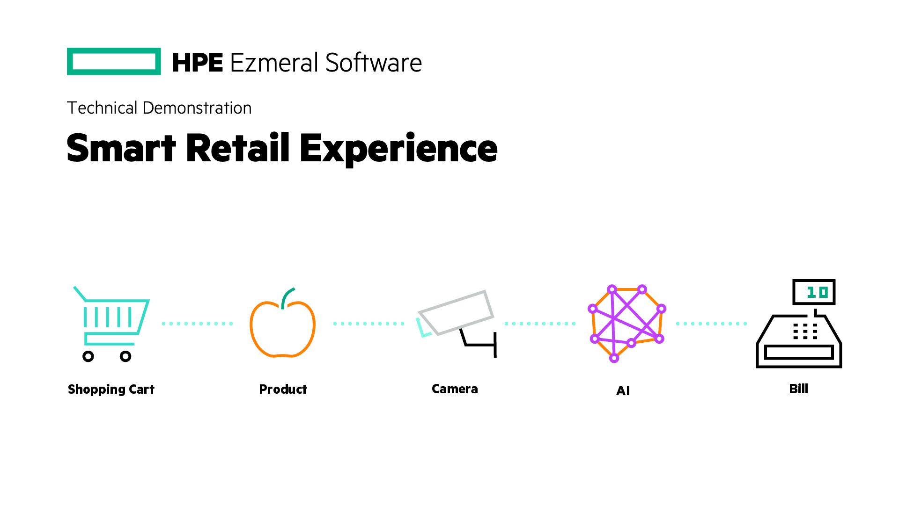

# Smart Retail Experience 
#### HPE Ezmeral Unified Analytics Technical Demonstration

In this technical demonstation, you will play the role of a seasoned data scientist at one of Europe's leading grocery chains. You are in charge of ingesting and presenting all of the sales numbers to gather crucial insights into how the business can operate more effectively; understanding what customers like and how they shop. Whilst presenting to your executives, you have been asked to come up with a new idea for the future of checkouts that leverages vision-based machine learning. 

This technical demonstration will run through how to use several of the most popular open-source data and machine learning tools that come natively bundled with **HPE Ezmeral Unified Analytics** to develop a new-age retail experience, including:

- **Apache Spark** and **Livy** for querying data files and creating Delta tables.
- **Apache Hive** for connecting the Delta Tables as a Unified Analytics Data Source in order to create datasets.
- **EzPresto** to retrieve data from datasets from any application. 
- **Apache Supersets** to create dashboards and visualize datasets.
- **Tensorflow** to train a machine learning model.
- **MLflow** to manage the training of and storing your machine learning models.
- **Kubeflow and KServe** to serve your models at scale to an API endpoint.

Let's dive in!

1. [What You'll Need](#what-youll-need)
1. [Procedure](#procedure)
1. [Functional Architecture](#functional-architecture)
1. [Clean Up](#clean-up)

## What You'll Need

For this tutorial, ensure you have:

- Access to an **HPE Ezmeral Unified Analytics** cluster.

## Procedure

To complete this tutorial follow the steps below:

1. Login to your Unified Analytics cluster using your credentials.
1. In the left sidebar menu of the Unified Analytics dashboard, click `Notebooks`.
1. Click `New Notebook Server`.
1. Name the notebook `smart-retail`. Under the `Custom Notebook` dropdown, click the `Image` dropdown. Select the notebook image containing `jupyter-data-science`. Request at least 4 vCPU and 8Gi of memory for the Notebook server.
1. Wait for the notebook server to start. When it is ready, click `Connect`. JupyterLab will open in a new tab. 
1. Launch a new Terminal window, and clone the repository locally.
1. Navigate to the tutorial's directory (`ezua-tutorials/demos/smart-retail`).
1. Pip install 
1. Launch the `00.introduction.ipynb` notebook file.
1. Run the remaining notebook exercises `01` through `07`.

## Functional Architecture

## Clean Up

To clean up the resources used during this experiment, follow the steps below:

1. Navigate to the `Tools and Frameworks` page in your Unified Analytics cluster and open `Kubeflow`.
1. In the left toolbar, click `Endpoints`.
1. Delete the `retail-experiment` isvc that was launched in Exercize 6.
1. Navigate to the `Tools and Frameworks` page in your Unified Analytics cluster.
1. Under the `Data Science` tab, click on the three dots in the top-right corner of the `Smart Retail Experience` application. 
1. Click `Delete`.

